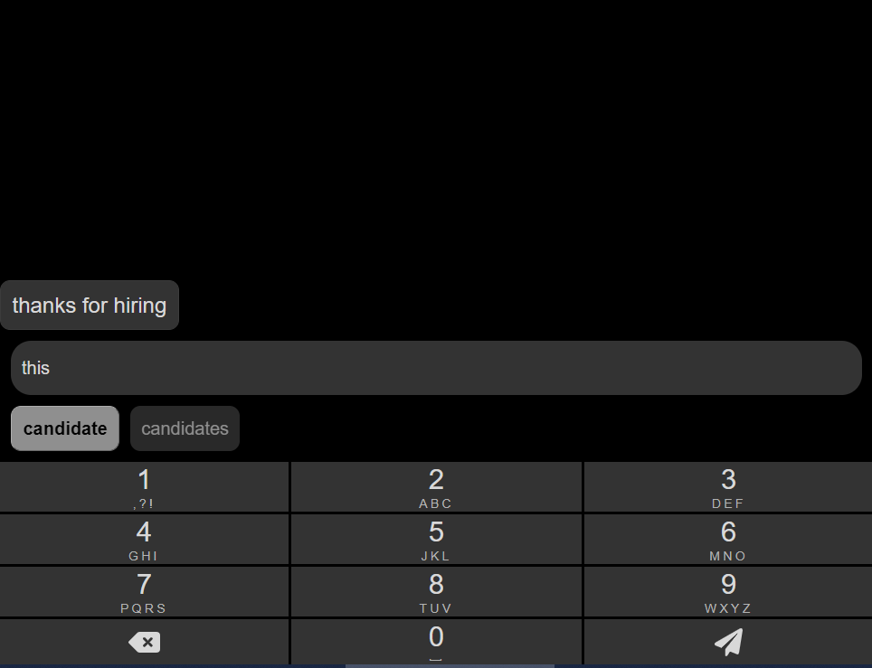
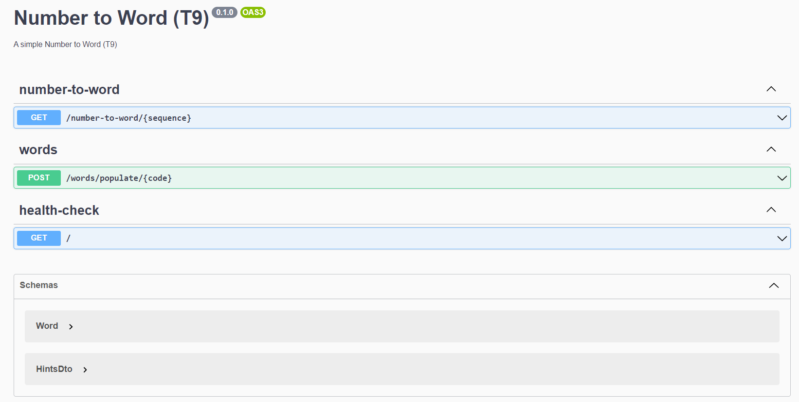

<h1 align="center">
  Number to Word - T9
</h1>

<p align="center">A full-stack aplication that simulates T9 keyboard ⌨️</p>

## Description

The project aims to simulate a T9 keyboard, where the frontend was developed in [React](https://reactjs.org/) + Typescript and the backend with [Nestjs](https://nestjs.com/) (Node + Typescript).



## 🔧 Prerequisite

To bring up the application, you **MUST** first:

* [x] Clone the repository
   - `git clone git@github.com:wenderpmachado/number-to-word-t9.git`
* [x] Install the dependencies
   - `yarn install` or` npm install`
* [x] Set the environment variables
   - Renaming the `.env.example` file to` .env`
   - Fill in the secret information

## :rocket: Running the WEB
To start the web application, run the following code:

```bash
# development
$ cd web
$ yarn start
```

## :rocket: Running the API
To start the API, run the following code:

```bash
# development
$ cd api

# running mongodb database
$ docker compose -f "api\docker-compose.yml" up -d --build

# running the server
$ yarn start:dev
```

After the database and the server are running, make a request to populate the database with the most used words in English. You can check it on the API documentation url:

> http://localhost:4000/api



## :heavy_check_mark: Test

The project has implemented unit tests:

```bash
# unit tests
$ yarn test
```

> *FYI: Currently just the core algorithm was well tested*

<hr>

## Roadmap 🔭

> API
* [ ] Increase the unit test coverage
* [ ] Add CI/CD with GitHub Actions
* [ ] Add Node start up on `docker-compose`
* [ ] Add migration concept to populate the database
* [ ] Make a smart search depending on what the user selected previously 

> Web
* [ ] Add ESlint/Prettier on `Web`
* [ ] Implement tests
* [ ] Implement redux to store the messages

## :wave: Stay in touch

- Author - [Wender Machado](https://www.linkedin.com/in/wenderpmachado)
